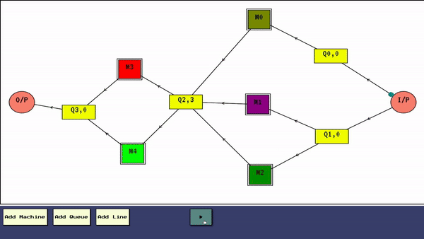

# Producer-Consumer Simulation App


Welcome to the **Producer-Consumer Simulation App**! This application leverages Spring Boot, WebSockets, JavaScript, and Canvas to simulate and visualize complex producer-consumer systems in real-time. Whether you're a developer, researcher, or enthusiast, this project provides an interactive and insightful look into multithreading and real-time data processing.

## 🚀 Features

- **Real-Time Visualization:** Interactive GUI to map and visualize queues and machines with dynamic animations.
- **Live Data Updates:** Seamless real-time updates using WebSockets to keep the frontend synchronized with backend processes.
- **Multithreaded Backend:** Efficient handling of concurrent processes with advanced multithreading and synchronization techniques.
- **Dynamic Pipeline Simulation:** Transform visual graphs into operational pipelines, demonstrating real-world producer-consumer scenarios.

## 💡 How It Works

1. **Frontend Visualization:** Utilize JavaScript and Canvas to create a responsive and interactive map of connected queues and machines. Custom animations illustrate the flow of products through the system.

2. **Backend Processing:** Built with Spring Boot, the backend uses multithreading and locking mechanisms to simulate the producer-consumer pipeline. It processes and manages concurrent tasks efficiently.

3. **Real-Time Communication:** WebSockets are employed to push live updates from the backend to the frontend, ensuring that the visual representation remains accurate and up-to-date.

## 📂 Getting Started

### Prerequisites

- **Java 17+** - For running the Spring Boot application.
- **Maven** - For building the Spring Boot application.
- **Web Browser** - To interact with the frontend visualization.

### Installation

1. **Clone the Repository:**

    ```bash
    git clone [https://github.com/Mahmoud-Moh/ProducerConsumer.git]
    cd ProducerConsumer-main
    ```

2. **Backend Setup:**

    Navigate to the `backend` directory and build the application using Maven:

    ```bash
    cd backend
    mvn clean install
    ```

    Run the Spring Boot application:

    ```bash
    mvn spring-boot:run
    ```

3. **Frontend Setup:**

    Navigate to the your browser and type in the path of the index.html file in front folder.

## 📄 Usage

- **Create and Customize:** Use the GUI to add and configure queues and machines.
- **Watch the Simulation:** Observe the real-time flow of products through the system with animated visualizations.
- **Monitor Updates:** Check the backend logs and WebSocket messages for detailed processing insights.

## 🛠️ Contributing

Contributions are welcome! If you have suggestions, improvements, or issues, please submit a pull request or open an issue.

## 📞 Contact

For any inquiries or feedback, feel free to reach out:

- **Email:** mahmoudmohamed669401@gmail.com
---

Happy simulating! 🚀
